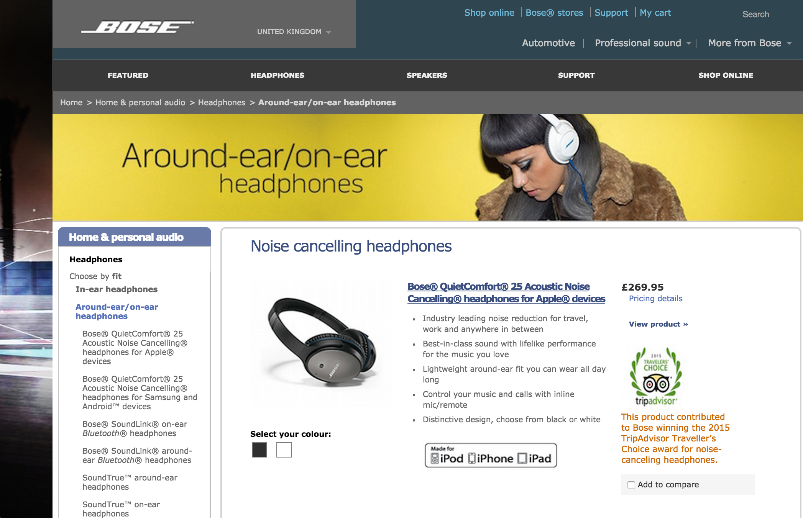
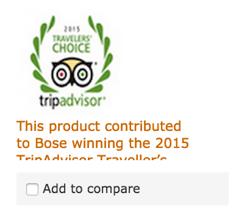
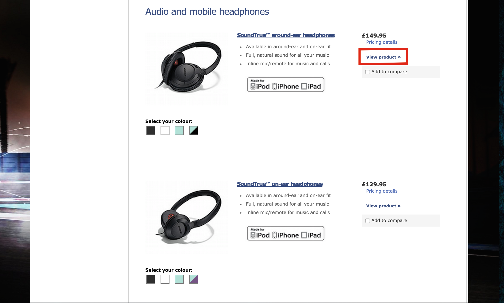
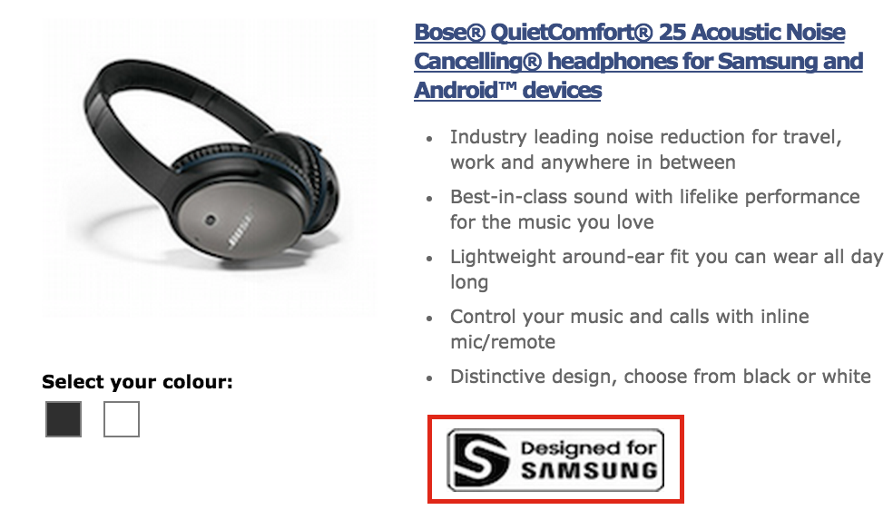
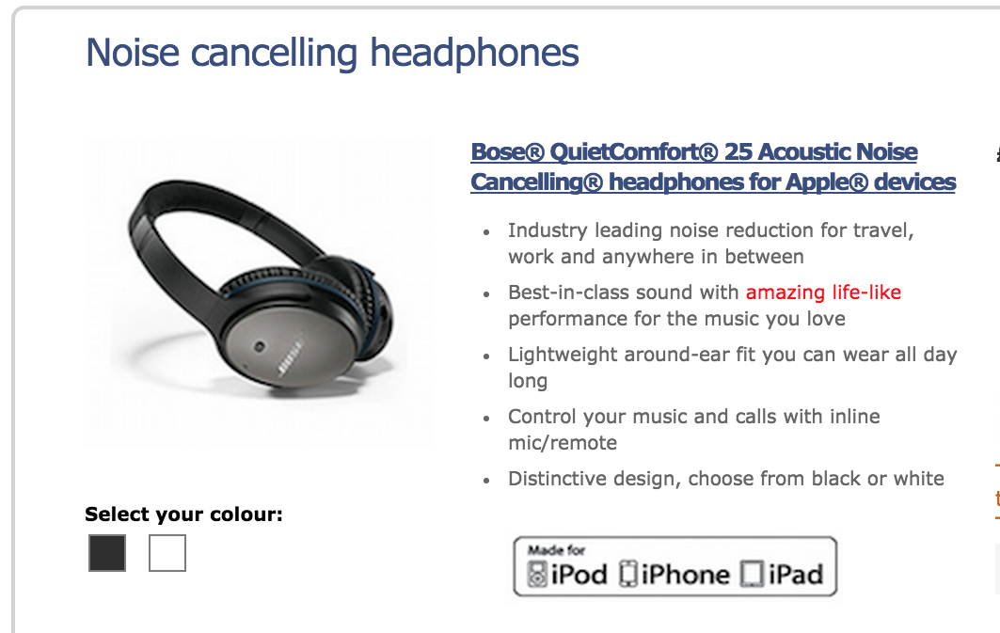
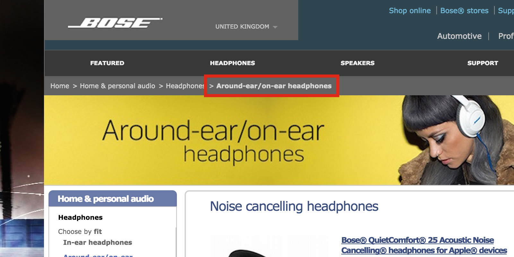

### Instructions

*Be aware:* most of the links on the page do not lead anywhere. This is intentional and fixing them is not part of this challenge. There are also a number of 404 errors visible in the browser console: these can be ignored as they are also not part of the actual test.
  
These are the individual changes you are required to indentify and correct within the web page.

1. **Set the banner image to display this image as the background**  
  
---  

2. **This text is overflowing its container. Resize the container to make sure all the text is visible**  
  
---  

3. ** the "View product" text in the red box a url that points to [this page](https://www.bose.co.uk/GB/en/home-and-personal-audio/headphones/audio-and-mobile-headphones/soundtrue-around-ear-headphones/)**  
  
---  

4. ** the "Designed for Samsung" image 18px to the right, so that it is vertically aligned with the text in the list items above (as shown)**  
  
---  

5. **Change the text content of the second list item so that it says "amazing life-like". Make sure life-like is all on the same line**  
  
---  

6. **Give the last list item in the site map a font-weight of 700**  
  
---  

7. **Now look through the page and try to spot any additional errors. Note these down, along with how you would go about correcting them.** These will all be visual/stylistic errors or inconsistencies and not related to any functionality.
